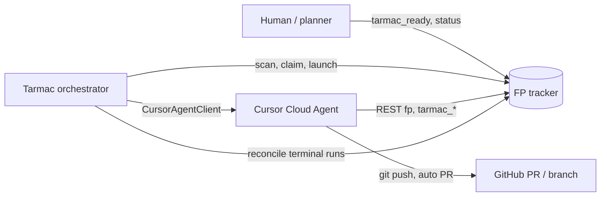

# Tarmac Application Specification

Status: Active  
Normative keywords: **MUST**, **MUST NOT**, **SHOULD**, **SHOULD NOT**, **MAY** (RFC 2119 sense).

## Purpose

This document is the build and behavioral contract for **Tarmac**: an FP-backed local
orchestrator that dispatches eligible issues to **Cursor Cloud Agents**. It tells
future implementers what to build, what to preserve, and what invariants the
system maintains.

Symphony and Switchyard are **historical inspiration** for the tracker/scheduler
shape only. Tarmac is **not** a Symphony Codex app-server clone. This spec does
not require access to any external Symphony `SPEC.md` path.

### Out of scope for this spec

The following Symphony/Codex assumptions **MUST NOT** be revived in Tarmac:

- Codex app-server transport, threads, turns, or dynamic-tool protocols
- stdio or archive/bundle artifact handoff as the primary worker contract
- App-server lifecycle as the runner boundary
- Cursor legacy `/v0/agents` REST as the active integration surface
- Local `.fp` project state inside the worker checkout
- Secret or token material in prompts, logs, issue comments, PR text, or artifacts

Operational setup and CLI commands belong in
[GETTING_STARTED.md](../../GETTING_STARTED.md), not here.

## Goals

- Provide a durable FP-visible dispatch loop: human marks work ready, orchestrator
  claims and launches Cursor, worker completes branch/PR and FP metadata.
- Keep the orchestrator local and the worker remote (Cursor Cloud Agent + GitHub).
- Encode dispatch eligibility, claim ownership, and handoff in `tarmac_*` FP
  custom properties with a clear writer boundary.
- Support fake Cursor mode for local development without cloud credentials.
- Gate real Cursor launch behind host credentials, remote repo visibility, and
  documented worker secret injection (never prompt-embedded tokens).

## Non-goals

- Automatic retry/backoff for failed launches (human re-arm only in the prototype).
- Cross-process exactly-once claim (single orchestrator process per deployment).
- Webhook-driven dispatch (polling/reconcile first).
- Replacing FP as the system of record for issue status and run ledger.
- Porting Symphony runner protocol surfaces.

## System overview



| Role                | Responsibility                                                               |
| ------------------- | ---------------------------------------------------------------------------- |
| Human / planner     | Sets `tarmac_ready`, issue content, dependencies; re-arms failed runs.       |
| FP                  | Issue store, built-in `status`, `tarmac_*` properties, comments.             |
| Tarmac orchestrator | Eligibility scan, claim, base SHA pin, Cursor launch, pre-handoff reconcile. |
| Cursor worker       | Checkout at `tarmac_base_sha`, implement, verify, push branch/PR, update FP. |

Accepted architecture context: [0001-cursor-backed-symphony-loop.md](./0001-cursor-backed-symphony-loop.md).

## Components and package boundaries

Implementers **SHOULD** preserve these deployable units unless an ADR explicitly
supersedes them.

| Unit                 | Path                       | Contract                                                             |
| -------------------- | -------------------------- | -------------------------------------------------------------------- |
| Orchestrator CLI     | `apps/tarmac-orchestrator` | `scan`, `run-one`, `watch`, `reconcile`; owns pre-handoff FP writes. |
| FP domain            | `packages/fp-domain`       | Eligibility, claim helpers, `tarmac_*` encode/decode schemas.        |
| Cursor client        | `packages/cursor-client`   | `CursorAgentClient` over `@cursor/sdk` (fake + real).                |
| Worker prompt        | `packages/worker-prompt`   | Issue prompt rendering and secret redaction.                         |
| FP ops               | `ops/fp`                   | REST/no-clone proofs and env helpers.                                |
| Cursor ops           | `ops/cursor`               | Bootstrap script, host launch experiments.                           |
| FP extensions        | `.fp/extensions`           | Desktop property registration (`tarmac-dispatch.ts`).                |
| Cursor environment   | `.cursor/environment.json` | Cloud worker install entry (`ops/cursor/bootstrap-env.sh`).          |
| Cursor worker skills | `.cursor/skills`           | Issue-to-PR workflow for cloud agents.                               |
| Agent skills (repo)  | `.agents/skills`           | Local agent conventions (fp-task, drift, review).                    |

The orchestrator **MUST** depend on `@tarmac/fp-domain`, `@tarmac/cursor-client`,
and `@tarmac/worker-prompt`. Domain rules **MUST NOT** be duplicated ad hoc in the
CLI layer.

## FP domain model

### Built-in issue fields

- `status`: built-in FP status. Dispatch eligibility requires `todo` at scan time.
- `dependencies`, parent/child links: open blockers make an issue ineligible.

### Custom property surface

Registration: `.fp/extensions/tarmac-dispatch.ts`.  
Authoritative tables and state machine: [fp-boundary.md](./fp-boundary.md).

| Property            | Wire type | Values / notes                                                                                      |
| ------------------- | --------- | --------------------------------------------------------------------------------------------------- |
| `tarmac_ready`      | select    | `"true"` \| `"false"` (canonical wire values; UI labels such as Ready / Not Ready are display-only) |
| `tarmac_state`      | select    | `"idle"` \| `"active"` \| `"end"` \| `"needs-attention"`                                            |
| `tarmac_attempt`    | text      | Attempt counter string                                                                              |
| `tarmac_claim_id`   | text      | Durable idempotent claim key for this runner attempt                                                |
| `tarmac_agent_id`   | text      | Cursor durable agent ID                                                                             |
| `tarmac_run_id`     | text      | Cursor run ID                                                                                       |
| `tarmac_cursor_url` | text      | Inferred run URL (not an official Cursor deep-link contract)                                        |
| `tarmac_branch`     | text      | Worker-owned git branch                                                                             |
| `tarmac_pr_url`     | text      | Worker-owned PR URL                                                                                 |
| `tarmac_pr_number`  | text      | Numeric PR number as text                                                                           |
| `tarmac_base_sha`   | text      | Pinned base commit SHA                                                                              |
| `tarmac_head_sha`   | text      | Latest pushed head SHA                                                                              |
| `tarmac_last_error` | text      | Redacted failure summary                                                                            |

`tarmac_state` is a **human-glance mirror only**. Eligibility **MUST** be derived
from built-in `status`, `tarmac_ready`, dependency/child openness, the
orchestrator in-process active index, presence of `tarmac_agent_id` /
`tarmac_run_id`, and successful decode of all known `tarmac_*` fields—not from
`tarmac_state` alone.

## Eligibility

An issue **MUST** be treated as dispatch-eligible only when **all** hold:

1. Built-in `status` is `todo`.
2. `tarmac_ready` is `"true"`.
3. No dependency issue is open (`todo` or `in-progress`).
4. No child issue is open.
5. Issue ID is not in the orchestrator's same-process active run index.
6. No `tarmac_agent_id` or `tarmac_run_id` is set unless reconcile has proven
   the prior run terminal and the issue is human re-armed.
7. All present `tarmac_*` properties decode per `@tarmac/fp-domain` schemas.

Reference implementation: `packages/fp-domain/src/eligibility.ts`.

## Claim protocol

Within **one** orchestrator process (`tarmac watch` or `run-one`):

1. Acquire same-process mutex for the issue ID (`SameProcessClaimSet`).
2. Generate `tarmac_claim_id` as `{runnerId}:{attempt}:{uuid}`.
3. Write FP in one update: `status=in-progress`, `tarmac_state=active`,
   `tarmac_attempt`, `tarmac_claim_id`, `tarmac_ready=true`.
4. Re-read the issue.
5. Proceed only if `tarmac_claim_id` still matches, and neither
   `tarmac_agent_id` nor `tarmac_run_id` is set.
6. Abort launch without Cursor if ownership is lost.

**Prototype limitation:** two separate orchestrator processes **MAY** race; this
protocol does not provide cross-process exactly-once dispatch. Future work **MAY**
replace this with FP conditional updates or an external lock store.

Reference: `packages/fp-domain/src/claim.ts`, [fp-boundary.md](./fp-boundary.md#claim-protocol).

## Cursor dispatch contract

Before launch the orchestrator **MUST**:

1. Resolve `CURSOR_BASE_REF` (or configured base ref) to an exact remote SHA.
2. Record that SHA in `tarmac_base_sha`.
3. Build the worker prompt via `@tarmac/worker-prompt` including issue context and
   the required base SHA.
4. Pass FP REST env to Cursor only through supported worker env mechanisms in
   **real** mode (`FP_REMOTE=rest-api` plus required FP vars)—never embed tokens
   in the prompt text.
5. Launch via `CursorAgentClient` (`@cursor/sdk`), not legacy `/v0/agents`.

After successful launch the orchestrator **MUST** write `tarmac_agent_id`,
`tarmac_run_id`, `tarmac_cursor_url`, and **MAY** comment once with the run URL.

Cursor integration reference: [cloud-agent-api.md](../reference/cursor/cloud-agent-api.md), [ops/cursor/README.md](../../ops/cursor/README.md).

### Modes

| Mode   | Behavior                                                                        |
| ------ | ------------------------------------------------------------------------------- |
| `fake` | Deterministic local Cursor client; worker FP env optional.                      |
| `real` | Requires host `CURSOR_API_KEY`, remote repo visibility, and worker FP REST env. |

Real launch **MUST** remain gated until credentials and bootstrap proofs pass.

## Worker handoff contract

After Cursor accepts the run, the **worker** owns:

- Git branch and PR (prefer Cursor `autoCreatePR` for the first demo).
- `tarmac_branch`, `tarmac_pr_url`, `tarmac_pr_number`, `tarmac_head_sha`.
- Verification comments and evidence uploads.
- Terminal built-in `status` and `tarmac_state`.

The worker **MUST**:

- Run `fp` from a **non-repo** workdir with REST env only
  ([fp-rest-no-clone.md](../reference/fp-rest-no-clone.md)).
- Fetch and checkout exact `tarmac_base_sha` before editing; stop with
  `needs-attention` if HEAD does not match.
- Never print or persist credential names/values in repo, PR, comments, or artifacts.

The orchestrator **MUST NOT** overwrite populated PR metadata after worker handoff.

## Reconciliation

The orchestrator **MAY** poll Cursor for terminal states on active runs:

| Cursor terminal               | FP routing                                                                                                           |
| ----------------------------- | -------------------------------------------------------------------------------------------------------------------- |
| `ERROR`, `EXPIRED`, cancelled | `tarmac_state=needs-attention` + redacted `tarmac_last_error`, unless worker already recorded successful PR metadata |
| `FINISHED`                    | `tarmac_state=end` only after `tarmac_pr_url` or explicit worker terminal comment                                    |

Reconcile **MUST** preserve branch/PR fields written by the worker.

## Lifecycle (coarse)

Human-visible `tarmac_state` transitions (detail in [fp-boundary.md](./fp-boundary.md)):

| State             | Meaning                                               |
| ----------------- | ----------------------------------------------------- |
| `idle`            | Default before claim.                                 |
| `active`          | Claimed and/or Cursor run in flight.                  |
| `end`             | Successful worker completion or durable PR handoff.   |
| `needs-attention` | Launch, Cursor, FP, verification, or handoff failure. |

**Human re-arm:** For `needs-attention`, a human **MUST** return the issue to
`todo` with `tarmac_ready=true` to retry. Prior branch/PR metadata **SHOULD** be
preserved; the orchestrator **MUST** issue a new `tarmac_claim_id` before relaunch.
No automatic retry in the prototype.

## Configuration and environment

### Orchestrator (host)

| Variable                    | Required    | Role                                          |
| --------------------------- | ----------- | --------------------------------------------- |
| `CURSOR_API_KEY`            | real mode   | Host-only Cursor API access                   |
| `CURSOR_BASE_REF`           | recommended | Base branch/ref resolved to `tarmac_base_sha` |
| FP vars for orchestrator    | yes         | Local `fp` project link for scan/claim        |
| `GITHUB_TOKEN` / `GH_TOKEN` | optional    | Host redaction list only; not prompt-embedded |

Worker FP env for real mode **MUST** include: `FP_REMOTE=rest-api`, `FP_TOKEN`,
`FP_WORKSPACE`, `FP_PROJECT_ID`, `FP_SERVER_URL`; **MAY** include
`FP_PROJECT_PREFIX`.

### Cursor cloud worker

- Install: `.cursor/environment.json` → `ops/cursor/bootstrap-env.sh` (idempotent).
- Secrets: Cursor-managed or documented host injection—**MUST NOT** live in repo files.

Env printing helpers in `ops/fp` **MUST** redact tokens by default.

## Observability

- Orchestrator and domain code **SHOULD** use structured logging via Effect patterns
  ([observability.md](../patterns/observability.md)).
- FP extension logs issue status transitions at info level.
- Run visibility: `tarmac_cursor_url`, orchestrator comments (once per run), Cursor UI.
- Failures **MUST** surface in `tarmac_last_error` redacted and in FP comments without secrets.

## Failure modes

| Failure                      | Owner               | Expected outcome                                                 |
| ---------------------------- | ------------------- | ---------------------------------------------------------------- |
| Ineligible issue at scan     | Orchestrator        | Skip; no FP mutation                                             |
| Claim lost before launch     | Orchestrator        | No Cursor launch; optional `needs-attention`                     |
| Missing worker FP env (real) | Orchestrator        | Launch blocked; `needs-attention` with redacted summary          |
| Cursor launch error          | Orchestrator        | `needs-attention`, `tarmac_last_error`                           |
| Base SHA mismatch in worker  | Worker              | `needs-attention`; no edits on moving `main`                     |
| Verification failure         | Worker              | `needs-attention` or handoff comment; issue stays open           |
| REST property write failure  | Worker/orchestrator | Document blocker; comments-only fallback until REST proof passes |

## Verification expectations

Repository gates (orchestrator and packages):

```bash
bun run format:check
bun run check    # oxlint, ast-grep, drift, typecheck
bun run test     # after non-trivial code changes
```

Product proofs:

- FP REST round-trip of all `tarmac_*` keys from a non-repo directory
  (`ops/fp/rest-no-clone-e2e.ts`, QA scenario `packages/qa/scenarios/fp-rest-no-clone-e2e.md`).
- Fake Cursor dispatch path in CI-friendly mode.
- Gated real Cursor bootstrap (`packages/qa/scenarios/cursor-bootstrap-e2e.md`).

Workers **SHOULD** run scoped tests first, then root gates before marking issues terminal.

## Prototype limitations

Implementers **MUST** treat the following as current truth, not bugs to paper over:

1. **Single-process claim** — only one `tarmac watch` / `run-one` process per operator environment without external locking.
2. **`tarmac_state` is non-authoritative** — always derive eligibility from FP status, `tarmac_ready`, graph, and run IDs.
3. **Human-gated retry** — return to `todo` + `tarmac_ready=true`; no auto-retry.
4. **Real Cursor gated** — credentials, GitHub visibility, bootstrap, and worker secret plumbing.
5. **No secrets in artifacts** — prompts, logs, comments, PR bodies, and uploaded evidence stay redacted.

## Implementation-defined areas

The following **MAY** vary between releases without violating this spec, provided
invariants above hold:

- CLI flag names and default poll intervals.
- Exact Cursor SDK version pin (documented in `ops/cursor/README.md`).
- Prompt template layout in `@tarmac/worker-prompt`.
- Optional `gh`-driven PR path behind explicit token provisioning gates.
- Webhook or multi-orchestrator locking (future ADRs).

## Supporting links

| Doc                                                                          | Topic                                       |
| ---------------------------------------------------------------------------- | ------------------------------------------- |
| [0001-cursor-backed-symphony-loop.md](./0001-cursor-backed-symphony-loop.md) | ADR: Cursor vs Codex, writer boundaries     |
| [fp-boundary.md](./fp-boundary.md)                                           | Property table, state machine, claim detail |
| [cloud-agent-api.md](../reference/cursor/cloud-agent-api.md)                 | Cursor API/SDK surfaces                     |
| [fp-rest-no-clone.md](../reference/fp-rest-no-clone.md)                      | Worker FP REST workdir                      |
| [ops/cursor/README.md](../../ops/cursor/README.md)                           | Bootstrap, host secrets, SDK pin            |
| [GETTING_STARTED.md](../../GETTING_STARTED.md)                               | Install, CLI, fake vs real                  |
| [AGENTS.md](../../AGENTS.md)                                                 | Agent map and commands                      |
